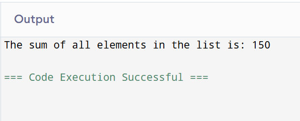

# List Operations in Python: Sum of List Items

## 🎯 Aim
To write a Python program that calculates the **sum of all elements** in a list.

## 🧠 Algorithm
1. Define a list of numbers.
2. Use Python’s built-in `sum()` function to calculate the total.
3. Print the result.

## 🧾 Program

```
my_list = [10, 20, 30, 40, 50]
result = sum(my_list)
print("The sum of all elements in the list is:", result)
```
## Output


## Result
Thus the program has been executed successfully.
